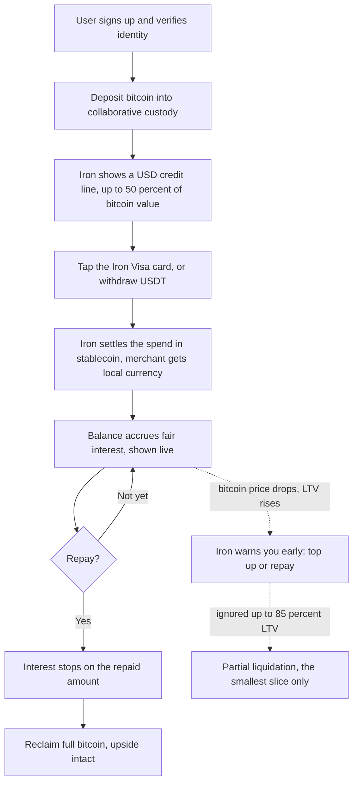
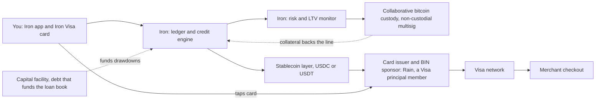
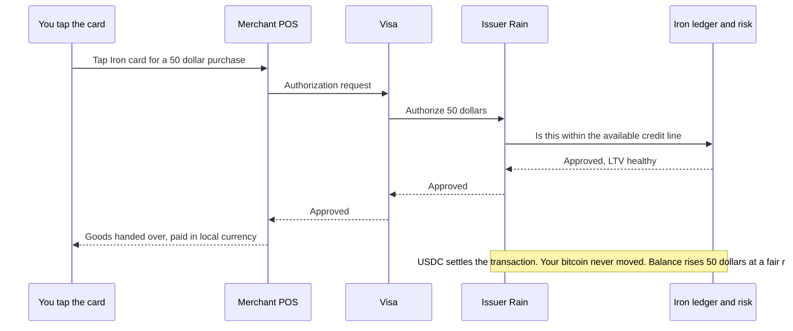

# Iron: the path to a working prototype, and how the system works

**Definition of "working prototype": you tap an Iron card at a real checkout and buy something, funded by borrowing against your bitcoin.** That single demo unlocks angel investment and a debt facility. Everything below is the cheapest, fastest path to that moment, plus the diagrams of how the real system works.

---

## The critical path (tap a card at a POS)

### Phase 0, this week: Wizard of Oz (cost: about the price of the coffee you buy)
Do not integrate any issuer for the first demo. Fake the backend, make the front-end real. The demo's job is to prove the experience, not to ship infrastructure.

1. Get an **Oobit** card. It is non-custodial, live in the Philippines, supports bitcoin, does NFC tap-to-pay, and converts to pesos at the register. It is almost the exact Iron experience off the shelf. Backup: **Bitget Wallet Card** (also live in APAC).
2. Manually run the loan: take your own bitcoin, produce USDC or USDT (a swap, or a real DeFi loan on Aave), load the card.
3. Tap at a Manila merchant. Film it. Narrate the "credit line" step that you are operating by hand.
4. Wrap the front-end in the existing Iron React UI so the audience sees Iron, not Oobit.

### Phase 1, 2 to 4 weeks: a clickable technical demo
Build on **Immersve's public sandbox** (non-custodial, per-user USDC deposit contracts, spend via Apple/Google Pay). This shows a real card-issuing API flow and "spend from self-custody," without enterprise onboarding. Request sandbox keys from their support.

### Phase 2, parallel and long lead: open Rain now
**Rain (rain.xyz) is the ideal real partner.** It is a Visa principal member that settles in USDC and already runs a non-custodial-collateral credit-card model, almost identical to Iron's thesis, and it covers APAC. It is an enterprise integration (8 to 12 weeks, KYB, sales-gated, no public pricing), so start the conversation now and clarify two things: (a) can bitcoin be the collateral directly, and (b) Philippines availability plus pricing and minimums. Keep **Baanx** (it explicitly offers crypto-collateralized credit, "Cryptodraft," and powers the MetaMask and Ledger cards) and **Reap** (Asia-native Visa principal issuer) as warm alternates.

**The unlock:** once you can tap the card, even with the concierge backend, you can credibly raise the pre-seed (Fulgur) and arrange the debt facility for the loan book.

---

## Two design and brand flags (do not skip)

1. **Bitcoin-vs-stablecoin collateral gap.** Every rail here (Rain, Immersve) is built around *stablecoin* collateral, not bitcoin. Iron's "lock bitcoin" promise needs an explicit bitcoin-to-stablecoin collateral layer (custody plus a swap or borrow, or a bitcoin-backed stablecoin). Design for it now and confirm it in every partner conversation.
2. **Naming collision.** A separate fintech called **"Iron"** (a stablecoin-payments platform that MoonPay acquired in 2025) already operates in the crypto-card space and powers MoonPay's stablecoin card. Run a trademark search (IPOS Singapore and USPTO, class 36) before locking the brand and printing cards. The `iron.credit` domain and the `.credit` TLD differentiate somewhat, but confirm with counsel.

---

## How it works: user journey

## How it works: system architecture

## How it works: what happens when you tap

*(These Mermaid diagrams render on GitHub. They can also be rebuilt as a visual page on the site for the pitch and the design workshop.)*
